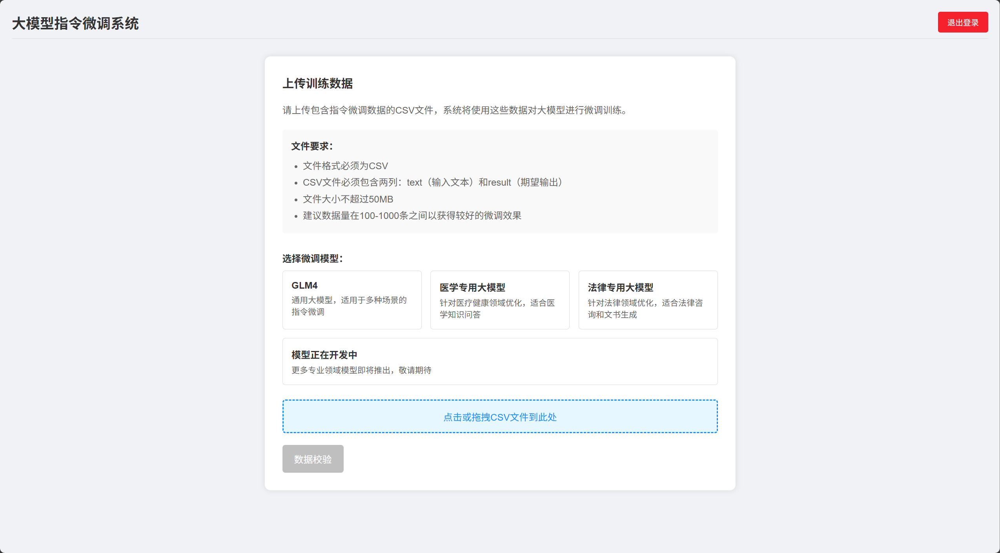

# 大模型指令微调系统

## 项目概述

本项目是一个基于Flask的Web应用，用于大模型指令微调系统。系统支持用户上传CSV格式的指令数据，对大模型进行微调训练，以提升模型在特定领域的表现能力。系统提供了友好的Web界面，支持数据上传、数据校验、模型训练和训练状态查询等功能。



## 技术栈

### 前端技术
- HTML/CSS/JavaScript：构建用户界面
- Bootstrap：响应式UI组件库

### 后端技术
- Python 3.x：主要编程语言
- Flask：Web框架
- Flask-CORS：处理跨域请求

### 模型训练
- PyTorch：深度学习框架
- Transformers：Hugging Face的模型库
- PEFT：参数高效微调库
- SwanLab：训练监控与可视化

### 数据处理
- Pandas：数据处理库
- Datasets：Hugging Face的数据集库

## 目录结构

```
/
├── server.py                # Flask服务器主程序
├── login.html               # 登录页面
├── upload.html              # 数据上传页面
├── check.html               # 数据校验页面
├── chat.html                # 模型对话页面
├── users.csv                # 用户信息文件
├── utils/                   # 工具函数目录
│   ├── model_train.py       # 模型训练脚本
│   └── model_predict.py     # 模型预测脚本
├── uploads/                 # 上传文件存储目录
│   └── admin/               # 用户目录
│       ├── data/            # 训练数据目录
│       └── checkpoints/     # 模型检查点目录
└── model/                   # 预训练模型目录
    └── GLM-4-main/          # GLM-4模型目录
        └── finetune_demo/   # 微调示例
```

## 技术路线

1. **用户认证**：用户通过登录页面进行身份验证，系统为每个用户创建独立的数据和模型存储空间。

2. **数据上传**：用户上传包含指令微调数据的CSV文件，系统将文件保存到用户专属目录。

3. **数据处理**：系统将CSV文件转换为JSONL格式，适配大模型训练需求。

4. **数据校验**：系统对上传的数据进行校验，检查数据格式、内容质量，并提供校验报告。

5. **模型训练**：基于校验通过的数据，使用LoRA等参数高效微调技术对大模型进行训练。

6. **训练监控**：使用SwanLab监控训练过程，记录训练指标。

7. **模型部署**：训练完成后，系统保存微调模型，并提供模型调用接口。

## 使用方法

### 1. 启动服务

```bash
python server.py
```

### 2. 用户登录

访问 `http://localhost:5000/login` 进行登录，默认用户：
- 用户名：admin
- 密码：123456


### 3. 上传数据

1. 登录后进入上传页面
2. 准备CSV文件，包含两列：text（输入文本）和result（期望输出）
3. 上传CSV文件，系统会自动处理并校验数据


### 4. 数据校验

系统会自动检查上传的数据，并提供以下校验：
- 检查字段是否为空
- 检查内容长度是否合适
- 检查输入和输出是否有效区分
- 提供数据质量报告

### 5. 模型训练

1. 数据校验通过后，可以启动模型训练
2. 选择模型类型（GLM-4、医疗专用、法律专用等）
3. 系统会在后台启动训练任务，并提供训练ID


### 6. 查看训练状态

通过训练ID查询训练状态，包括：
- 训练进度
- 训练指标
- 错误信息（如有）
- 模型保存路径（训练完成后）

## 数据格式要求

### CSV文件格式

上传的CSV文件必须包含以下列：
- `text`：输入文本，用户提问或指令
- `result`：期望输出，模型应该生成的回答

示例：
```csv
text,result
"1+1","2"
"1+2","3"
"请介绍一下北京","北京是中华人民共和国的首都，是全国的政治、文化和国际交往中心..."
```

### JSONL转换格式

系统会将CSV转换为以下JSONL格式：
```json
{"instruction": "你是一个智能助手，请根据输入提供准确的回答", "input": "1+1", "output": 2}
{"instruction": "你是一个智能助手，请根据输入提供准确的回答", "input": "1+2", "output": 3}
```

## 模型类型

系统支持多种模型类型的微调：

1. **GLM-4**：通用大模型，适合多种任务
   - 指令前缀："你是一个智能助手，请根据输入提供准确的回答"

2. **医疗专用**：针对医疗领域优化
   - 指令前缀："你是一个医疗领域的专业助手，请根据医学知识回答以下问题"

3. **法律专用**：针对法律领域优化
   - 指令前缀："你是一个法律领域的专业助手，请根据法律知识回答以下问题"

## 微调配置

系统使用以下微调技术：

1. **LoRA**：低秩适应微调，高效调整模型参数
2. **P-Tuning v2**：提示词微调，适合特定任务
3. **SFT**：全参数监督微调

微调配置文件位于 `model/GLM-4-main/finetune_demo/config` 目录下。


## 注意事项

1. 建议上传100-1000条数据以获得较好的微调效果
2. 文件大小不超过50MB
3. 确保数据质量，避免无意义或重复的数据
4. 模型训练过程可能需要较长时间，请耐心等待
5. 训练完成后，模型会保存在用户的checkpoints目录下

## 后续开发计划

1. 支持更多模型类型
2. 增加模型评估功能
3. 提供API接口，方便集成到其他系统
4. 优化训练速度和资源占用
5. 增加数据增强和预处理功能

---

*注：本文档将随项目发展持续更新*